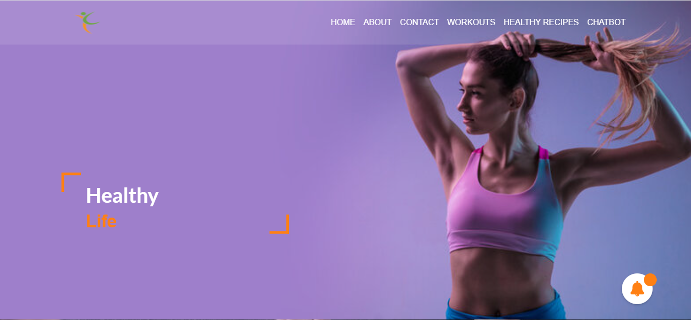
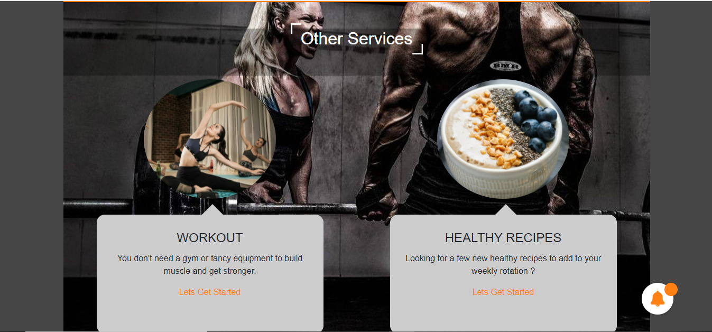
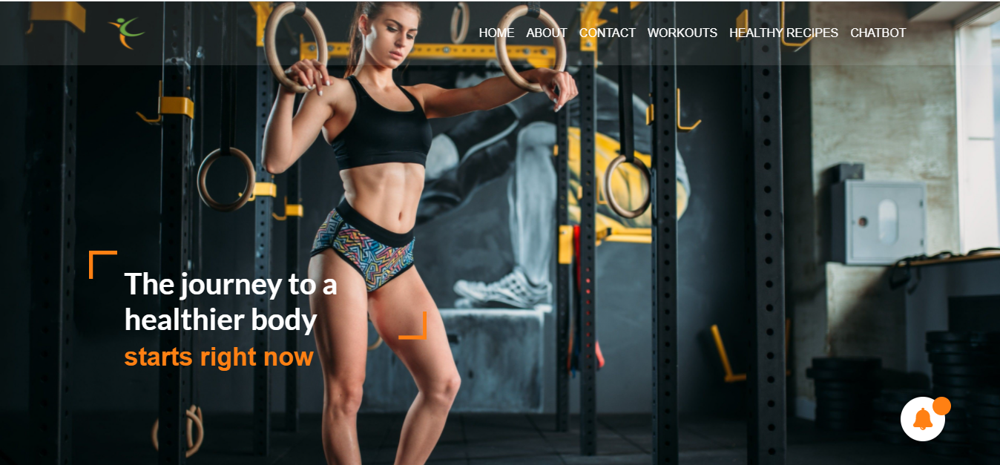
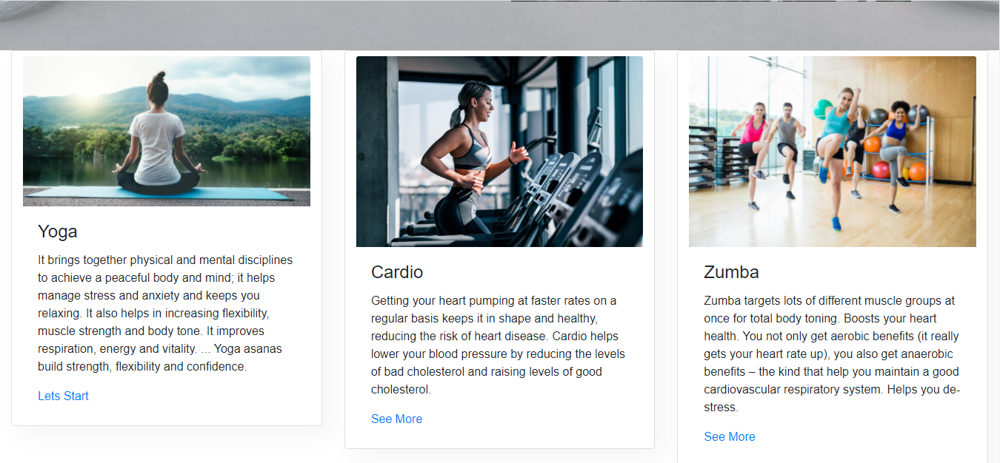
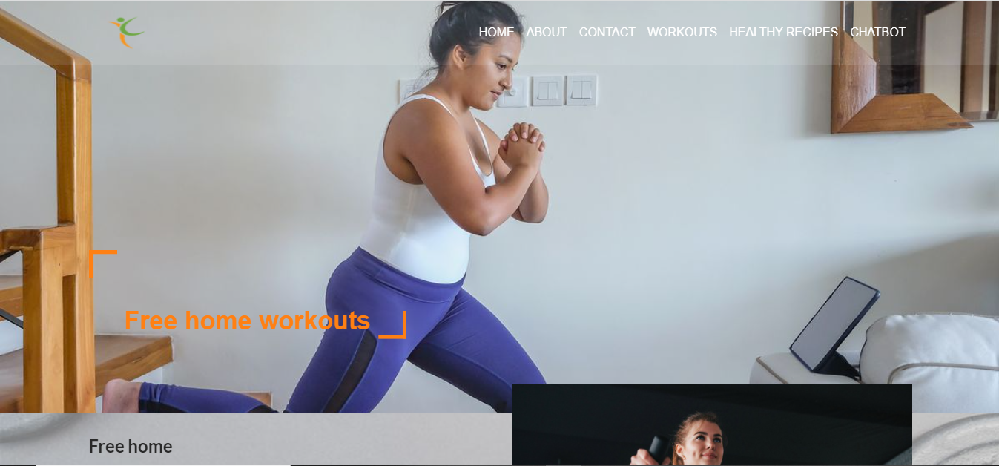

# Healthy Life
A website developed using HTML5, CSS3, Bootstrap and JavaScript. It is for fitness lovers that would help them to get basic idea about different diets, exercise,etc as well as different places where they can take reference from online. It is just a project I wanted to work on for fun.

# Key Features  of Healthy Life Website
1. Free Workout with different  forms of workout. 
2. Healthy  Recipes.
3. Personalized diet plan.
4. Chat bot for Workout and Nutrition Guide.

Homepage

About US

Our Service

Workout

Healthy Recipes

